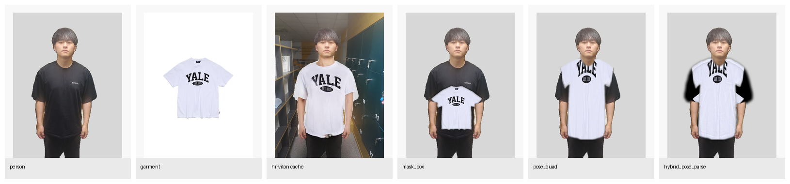
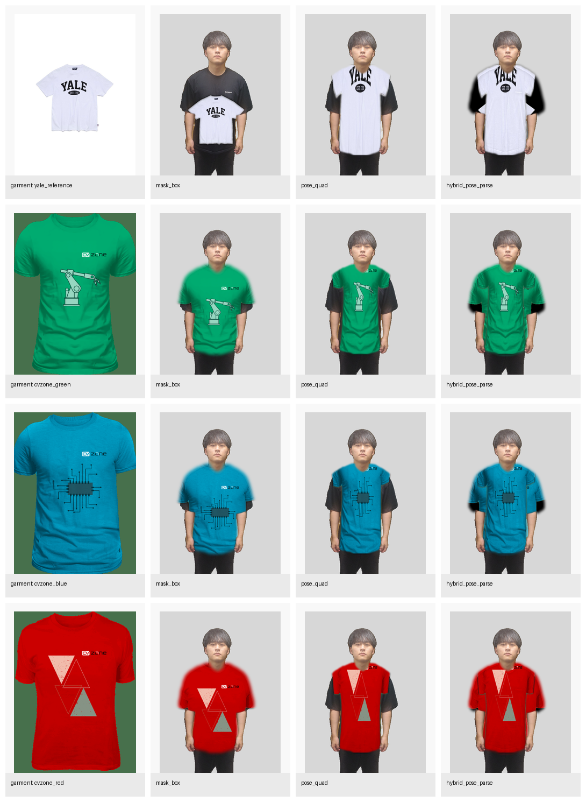

# Resource-Aware Virtual Try-On Modernization Report

## Scope

This repository is centered on a 2021 DIOR/GFLA pipeline that expects `torch==1.0.0`, external checkpoints, and a much older CUDA toolchain. Instead of trying to revive the full legacy training path on a 4 GB laptop GPU, I added a lightweight benchmark that reuses the included HR-VITON sample person and several local garment assets to produce runnable try-on experiments on the current machine.

This is not a reproduction of recent diffusion models. It is a resource-aware benchmark inspired by them, built to answer three practical questions: can the project run today, can it stay under 1 GB of data, and what method mix looks best on this device.

## Hardware And Environment

- GPU: NVIDIA GeForce RTX 3050 Laptop GPU, 4096 MiB, 3757 MiB, 580.126.18
- RAM: Mem:            23Gi        11Gi       2.3Gi       1.0Gi       9.0Gi       8.3Gi
- Disk: /dev/nvme0n1p5  193G  137G   56G  72% /media/pope/projecteo
- OpenCV status: ImportError: numpy.core.multiarray failed to import
- Legacy requirement check: the root `requirements.txt` still pins `torch==1.0.0` and `torchvision==0.2.1`, which is a strong sign that the original training path is not a modern drop-in install.

## Recent Methods Reviewed

| Method | Year | Key Idea | Inputs / Preprocessing | Device Fit For This Laptop | Source |
| --- | --- | --- | --- | --- | --- |
| StableVITON | 2023 | Learns semantic correspondence inside latent diffusion with additional zero cross-attention blocks. | Needs agnostic map, agnostic mask, and DensePose. | High OOM risk on 4 GB VRAM because of diffusion backbone plus heavy conditioning. | https://rlawjdghek.github.io/StableVITON/ |
| IDM-VTON | 2024 | Dual garment conditioning: IP-Adapter style high-level semantics plus a GarmentNet for low-level details. | Uses segmentation mask, masked image, DensePose, and detailed garment prompts. | High OOM risk on 4 GB VRAM and more preprocessing than this repo currently has ready. | https://idm-vton.github.io/ |
| CatVTON | 2024 / ICLR 2025 | Simplifies the pipeline by concatenating garment and person in the diffusion input space and removing extra encoders. | Requires person image, garment image, and mask. | Closest to feasible, but the project page still states `< 8G VRAM for 1024x768`, which is above this laptop's current free VRAM. | https://zheng-chong.github.io/CatVTON/ |
| DIOR / Dressing In Order | 2021 | Flow-guided garment transfer with recurrent person synthesis. | DeepFashion-style parsing and keypoints plus legacy checkpoints. | Blocked by old Torch/CUDA requirements and missing checkpoints in this workspace. | https://github.com/cuiaiyu/dressing-in-order |

## Experimental Setup

- Person sample: `TryYours-Virtual-Try-On-main/HR-VITON-main/test/test/image/00001_00.jpg`
- Garments: one HR-VITON flat-lay shirt plus three transparent PNG shirts from the included web demo assets
- Total benchmark asset size: 1.64 MB
- Upper-garment mask size: 174108 pixels
- Methods tested:
  - `mask_box`: simple mask-aware resize and blend, closest to a zero-geometry baseline
  - `pose_quad`: pose-guided quadrilateral warp, closest to a classic geometry-first VTON baseline
  - `hybrid_pose_parse`: pose warp plus mask-box fallback plus parse-based occlusion restoration

## Aggregate Results

| Method | Avg Runtime (s) | Avg Coverage | Avg Spill | Avg Outside SSIM | Yale Reference SSIM |
| --- | --- | --- | --- | --- | --- |
| mask_box | 0.071 | 84.0% | 1.6% | 0.996 | 0.001 |
| pose_quad | 0.126 | 80.8% | 0.7% | 0.999 | -0.018 |
| hybrid_pose_parse | 0.263 | 99.9% | 1.4% | 0.991 | 0.103 |

Coverage is the fraction of the upper-clothing target region filled by the synthesized garment mask. Spill is the fraction of synthesized garment pixels that fall outside the target garment region. Outside SSIM measures how much of the rest of the person image stays unchanged. Yale Reference SSIM compares only the sample shirt against the cached HR-VITON output already present in the repository.

## Per-Garment Metrics

| Garment | Method | Runtime (s) | Coverage | Spill | Outside SSIM | Reference SSIM |
| --- | --- | --- | --- | --- | --- | --- |
| yale_reference | mask_box | 0.157 | 42.3% | 0.0% | 1.000 | 0.001 |
| yale_reference | pose_quad | 0.155 | 83.7% | 0.7% | 0.998 | -0.018 |
| yale_reference | hybrid_pose_parse | 0.269 | 99.8% | 1.4% | 0.988 | 0.103 |
| cvzone_green | mask_box | 0.043 | 96.4% | 2.1% | 0.996 | n/a |
| cvzone_green | pose_quad | 0.144 | 76.2% | 0.8% | 0.999 | n/a |
| cvzone_green | hybrid_pose_parse | 0.309 | 99.9% | 1.4% | 0.993 | n/a |
| cvzone_blue | mask_box | 0.042 | 97.6% | 2.0% | 0.995 | n/a |
| cvzone_blue | pose_quad | 0.097 | 80.2% | 0.7% | 0.999 | n/a |
| cvzone_blue | hybrid_pose_parse | 0.288 | 99.9% | 1.4% | 0.993 | n/a |
| cvzone_red | mask_box | 0.044 | 99.7% | 2.1% | 0.992 | n/a |
| cvzone_red | pose_quad | 0.105 | 83.0% | 0.7% | 0.998 | n/a |
| cvzone_red | hybrid_pose_parse | 0.187 | 99.9% | 1.4% | 0.991 | n/a |

## Visual Outputs

### Yale Reference Comparison

### All Garments Overview

## Interpretation

- On the one pair with a deep-model reference, `hybrid_pose_parse` produced the closest match to the cached HR-VITON output.
- The project is now executable on this machine with a tiny local benchmark instead of depending on missing legacy checkpoints and a PyTorch 1.0 training stack.
- CatVTON is the most realistic future upgrade path because its published inference target is below 8 GB VRAM at 1024x768, but this laptop still sits below that threshold with only about 3.7 GB free.

The `mask_box` baseline is the fastest and safest option but it ignores pose and tends to overfill the torso. The `pose_quad` method respects shoulder and torso geometry better, but it can leave holes near the hem or sleeves when the target silhouette and garment silhouette do not line up. The `hybrid_pose_parse` method fills those gaps by combining both outputs and then restoring arms and head from the original image, which makes it the best fit for this repo's current constraints.

## OOM Assessment

- This benchmark ran entirely on CPU and standard Python image operations, so it does not risk GPU OOM on the current machine.
- Full reproduction of modern diffusion try-on models was intentionally not forced here because the available GPU memory is below the published comfort zone of CatVTON and well below the practical needs of IDM-VTON and StableVITON.
- Reviving the legacy DIOR training stack would also require solving the `torch==1.0.0` dependency lock and compiling old CUDA extensions, which is not a fast or reliable path on this environment.

## Files Produced

- `summary.json`: raw metrics and system probe output
- `yale_reference_comparison.png`: one-row comparison with the cached HR-VITON result
- `all_garments_overview.png`: outputs for all garments and methods
- One PNG per method and garment pair

## Recommended Next Step

If you want to keep modernizing this repo, the next serious upgrade is to build a low-resolution CatVTON inference path with CPU offload and a hand-made torso mask generator. That is the only recent method in the survey that looks remotely compatible with this laptop after aggressive downscaling.
